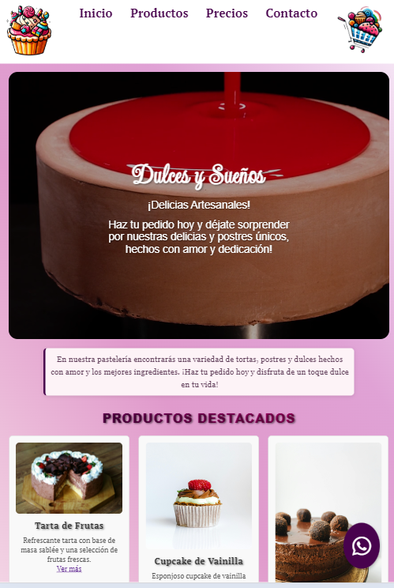
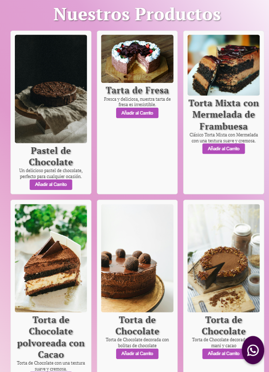

# Pastelería Talento Tech 🍰

¡Bienvenido a la página web de **Pastelería Talento Tech**! Aquí encontrarás una deliciosa selección de tortas, postres, cupcakes, y más, hechos con los mejores ingredientes y mucho amor.

## 📜 Descripción del Proyecto

Este proyecto es una página web diseñada para **Pastelería Talento Tech**, que permite a los usuarios explorar los productos destacados, realizar pedidos y mantenerse conectados a través de nuestras redes sociales.

## 🌟 Características

- **Página de Inicio**: Información sobre nuestra pastelería y los productos destacados.
- **Productos Destacados**: Sección que muestra los productos más populares con descripciones detalladas.
- **Formulario de Contacto**: Permite a los clientes ponerse en contacto para realizar consultas.
- **Redes Sociales**: Enlaces directos a nuestras redes sociales, incluyendo un ícono flotante de WhatsApp para contacto rápido.
- **Diseño Responsivo**: Adaptado para dispositivos móviles, tabletas y computadoras.

## 🛠️ Tecnologías Utilizadas

- **HTML**: Para la estructura del sitio web.
- **CSS**: Para los estilos y diseño visual.
- **JavaScript**: Para la funcionalidad interactiva.
- **Font Awesome**: Para los íconos de redes sociales.
- **Google Fonts**: Para fuentes personalizadas.

## 📂 Estructura del Proyecto

## 📸 Fotos de la Web

### Página Principal


### Productos Destacados


## 📋 Funciones Pendientes y Mejoras Futuras

### 🎨 Diseño Responsivo
- **Ajustes de Responsividad**: Optimizar la página para dispositivos móviles y tabletas, asegurando que todos los elementos sean visibles y accesibles en diferentes tamaños de pantalla.
- **Optimización del Menu de Navegación**: Implementar un menú tipo "hamburguesa" en dispositivos móviles para mejorar la navegación.

### 🛒 Funcionalidad de Compra
- **Carrito de Compras**: Añadir la funcionalidad de un carrito de compras que permita a los usuarios agregar productos antes de hacer un pedido.
- **Sistema de Pedidos**: Implementar un formulario para procesar pedidos y permitir a los usuarios elegir entre diferentes métodos de pago.

### 💬 Interactividad
- **Animaciones**: Agregar animaciones sutiles al interactuar con los botones y elementos destacados para mejorar la experiencia de usuario.
- **Notificaciones**: Implementar alertas o notificaciones para confirmar acciones, como cuando se agrega un producto al carrito.

### 🔄 Optimización y Funciones Avanzadas
- **Optimización de Imágenes**: Utilizar imágenes en formatos más ligeros (como WebP) para mejorar la velocidad de carga.
- **SEO Básico**: Añadir etiquetas meta y mejorar el contenido para optimizar el SEO.

## 🚀 Cómo Usar el Proyecto

1. **Clonar el repositorio**:
   ```bash
   git clone https://github.com/JesyGomez/Pasteleria-TalentoTech.git
